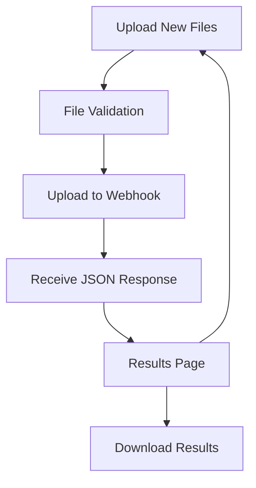

## 1. Product Overview
A web application for uploading and comparing two Excel files using n8n webhook processing. Users can upload files, trigger comparison via webhook, and view structured diff results with a clean, modern interface inspired by Chargebee design.

Target users: Business analysts, data managers, and teams needing quick Excel file comparison capabilities.

## 2. Core Features

### 2.1 User Roles
| Role | Registration Method | Core Permissions |
|------|---------------------|------------------|
| Guest User | No registration required | Upload files, view comparison results |

### 2.2 Feature Module
The Excel comparison tool consists of the following main pages:
1. **Upload page**: Drag-and-drop file upload, file validation, upload progress.
2. **Results page**: JSON diff display, added/removed/changed highlighting, download results.

### 2.3 Page Details
| Page Name | Module Name | Feature description |
|-----------|-------------|---------------------|
| Upload page | File upload area | Drag-and-drop two Excel files with validation for .xlsx/.xls formats. Show file names and sizes. |
| Upload page | Upload button | Trigger file upload to n8n webhook with form-data key 'data'. Show loading state during upload. |
| Upload page | Progress indicator | Display upload progress bar and status messages. |
| Results page | Diff viewer | Display JSON comparison results with added (green), removed (red), and changed (yellow) highlighting. |
| Results page | Summary stats | Show count of added, removed, and changed items. |
| Results page | Download results | Allow users to download comparison results as JSON file. |

## 3. Core Process
**User Flow:**
1. User visits upload page
2. User drags and drops two Excel files
3. System validates file formats
4. User clicks "Compare Files" button
5. System uploads files to n8n webhook as form-data with key 'data'
6. System receives JSON diff response from webhook
7. System navigates to results page
8. User views comparison results with color-coded differences
9. User can download results or upload new files

## 4. User Interface Design

### 4.1 Design Style
- **Primary colors**: Deep blue (#1e40af), white (#ffffff), light gray (#f8fafc)
- **Secondary colors**: Success green (#10b981), error red (#ef4444), warning amber (#f59e0b)
- **Button style**: Rounded corners (8px), subtle shadows, hover effects
- **Typography**: Inter font family, 16px base size, clean hierarchy
- **Layout**: Card-based design with generous whitespace
- **Icons**: Heroicons for consistent iconography

### 4.2 Page Design Overview
| Page Name | Module Name | UI Elements |
|-----------|-------------|-------------|
| Upload page | File upload area | Large drag-and-drop zone with dashed border, file type icons, upload progress bar with percentage. |
| Upload page | Action buttons | Primary blue "Compare Files" button, secondary "Clear Files" button. |
| Results page | Diff viewer | Scrollable JSON viewer with syntax highlighting, color-coded changes (green=added, red=removed, yellow=changed). |
| Results page | Summary cards | Three cards showing counts: Added items, Removed items, Changed items with appropriate colors. |

### 4.3 Responsiveness
Desktop-first design with mobile responsiveness. Touch-friendly interactions for mobile devices. Responsive grid system that adapts from 2-column layout on desktop to single column on mobile.