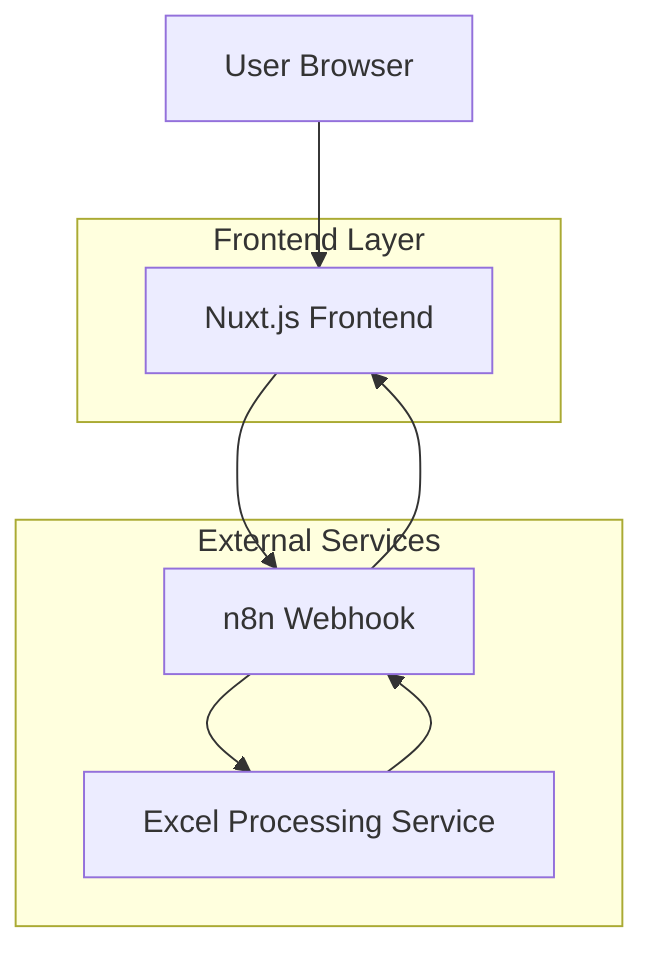
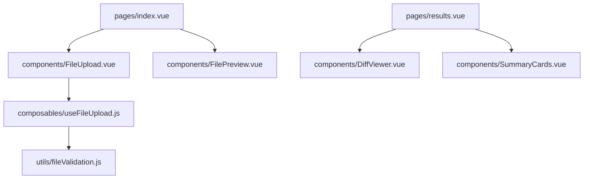

## 1. Architecture design



## 2. Technology Description
- Frontend: Nuxt.js@3 + Vue@3 + Tailwind CSS@3
- Initialization Tool: nuxt-init
- Backend: None (n8n webhook handles processing)
- File Upload: Native FormData API
- HTTP Client: $fetch (Nuxt's built-in fetch wrapper)

## 3. Route definitions
| Route | Purpose |
|-------|---------|
| / | Upload page - Main landing with file upload interface |
| /results | Results page - Displays JSON diff comparison results |
| /error | Error page - Shows upload/processing errors |

## 4. API definitions

### 4.1 Webhook Integration
**Webhook Request:**
```
POST {n8n_webhook_url}
Content-Type: multipart/form-data
```

Request Body (FormData):
| Param Name | Param Type | isRequired | Description |
|------------|-------------|-------------|-------------|
| data | File[] | true | Two Excel files to compare |

**Webhook Response:**
```json
{
  "status": "success",
  "data": {
    "added": [],
    "removed": [],
    "changed": [],
    "summary": {
      "total_added": 0,
      "total_removed": 0,
      "total_changed": 0
    }
  }
}
```

### 4.2 Error Handling
Error Response:
```json
{
  "status": "error",
  "message": "Invalid file format or processing error",
  "code": "INVALID_EXCEL"
}
```

## 5. Component Architecture



## 6. Data Flow

### 6.1 File Upload Process
1. User selects/drops files in FileUpload component
2. FilePreview displays selected files with validation
3. useFileUpload composable handles FormData creation
4. $fetch POST to n8n webhook with files as 'data' key
5. Navigation to results page with webhook response data

### 6.2 State Management
- Pinia store for file state management
- File data stored temporarily in memory only
- Results data passed via route state (no persistent storage)

## 7. File Validation

### 7.1 Supported Formats
- .xlsx (Excel 2007+)
- .xls (Excel 97-2003)
- Maximum file size: 10MB per file
- Maximum 2 files simultaneously

### 7.2 Validation Rules
```javascript
const validationRules = {
  maxSize: 10 * 1024 * 1024, // 10MB
  allowedTypes: [
    'application/vnd.openxmlformats-officedocument.spreadsheetml.sheet',
    'application/vnd.ms-excel'
  ],
  maxFiles: 2
}
```

## 8. UI Components Structure

### 8.1 FileUpload Component
- Drag-and-drop zone with visual feedback
- File input fallback for click-to-upload
- Progress indicator during upload
- Error message display

### 8.2 DiffViewer Component
- JSON syntax highlighting
- Color-coded differences (added/rem/changed)
- Expandable/collapsible sections
- Search functionality within results

### 8.3 SummaryCards Component
- Three metric cards (added/removed/changed)
- Responsive grid layout
- Animated number transitions
- Download results button